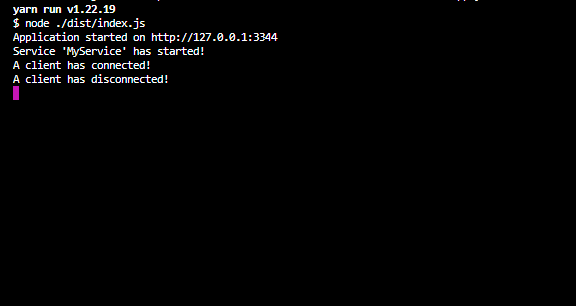

# Turbulent Test (Backend)

[](https://github.com/MathieuGermain/turbulent-test/actions/workflows/backend-ci.yml)


## Event Reminder Backend Application
This piece of software is in charge of handling client connections and processing `Event Reminders` so that it triggers in due time.

Multiple instances can run by setting unique values in `.env` config.

<br>

**Default `.env`**
```yml
SERVICE_ID = MyService
HOST = 127.0.0.1
PORT = 3344
```

**Persistence**
- `EventReminders` are stored in `home` directory.  
- The filename is the `Service ID`.
```yml
<home_dir>/EventReminders/<service_id>.json
```

<br>

## Usage

Make sure you have **yarn** installed globally.
> To learn more about **yarn** visit https://classic.yarnpkg.com/en/docs/getting-started
```bash
npm install --global yarn
```

Install dependencies
```bash
yarn
```

Build the server for production
```bash
yarn build
```

Start the server
```bash
yarn start
```

Run Jest Tests
```bash
yarn test
```

<br>

# Preview


