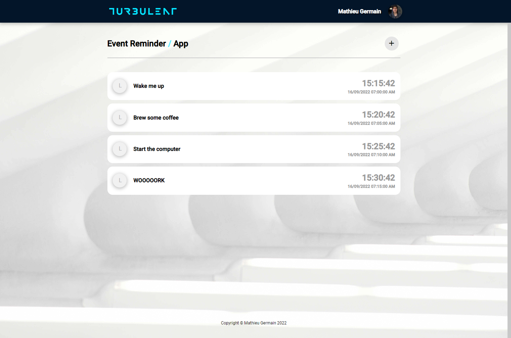
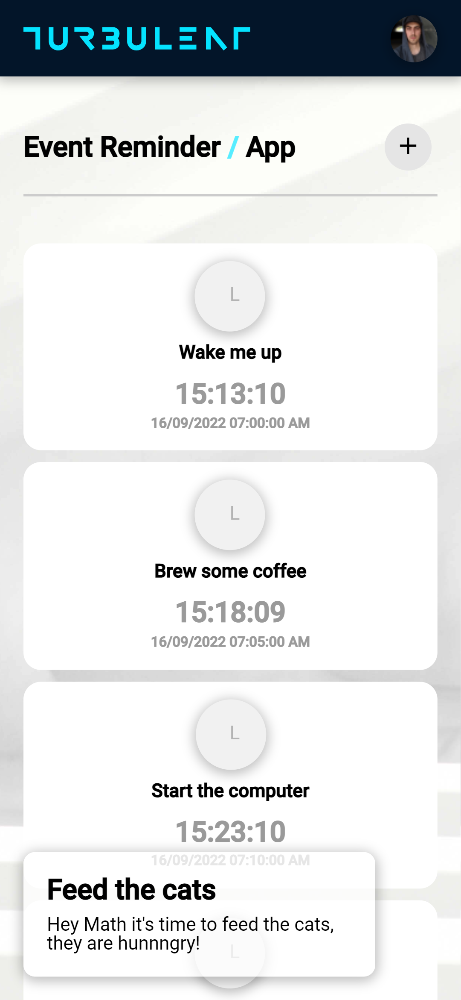

# Turbulent Test (Frontend)

[](https://github.com/MathieuGermain/turbulent-test/actions/workflows/frontend-ci.yml)

## Event Reminder Frontend Application
Even if it wasn't required I created this small Angular frontend to visualize and send new `EventReminder` to the backend.

\* *It doesn't contain Jasmine unit tests.*

<br>

## Usage

Make sure you have **yarn** installed globally.
> To learn more about **yarn** visit https://classic.yarnpkg.com/en/docs/getting-started
```bash
npm install --global yarn
```

Install dependencies
```bash
yarn
```

Serve the application in dev mode
> Access the page from http://localhost:4200/
```bash
yarn serve
```

Build the application for production
```bash
yarn prod:build
```

<br>

# Previews

## Desktop


## Mobile

